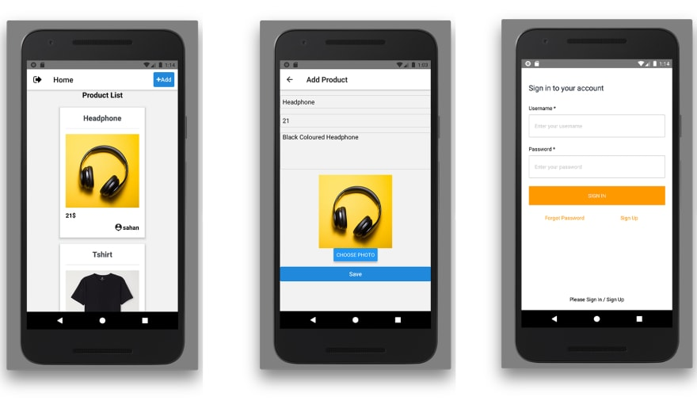
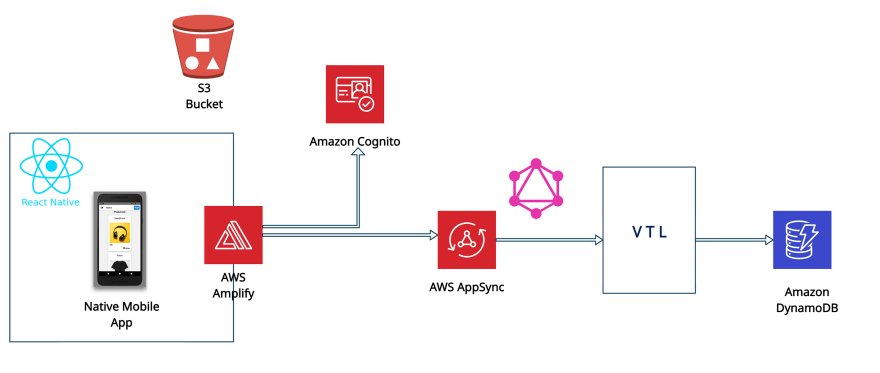
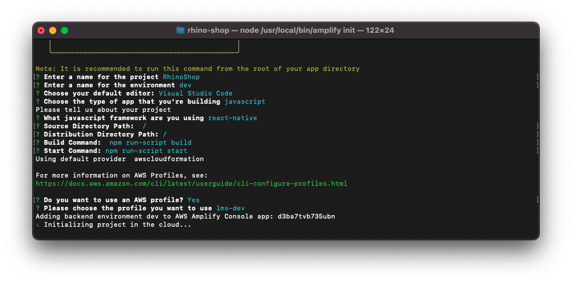
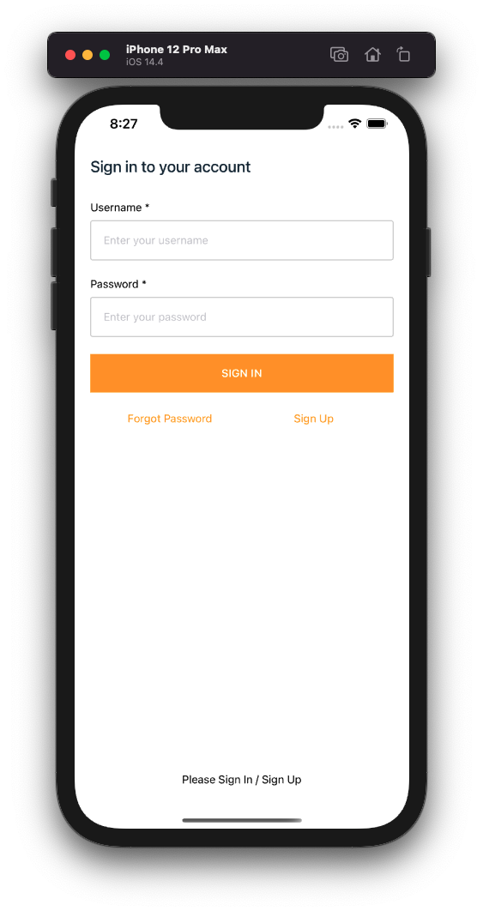

# Complete Guide to AWS Amplify and React Native
# Part 1

### Let’s Build an E-commerce App with ReactNative and Amplify

## Table of Content
1. Introduction
2. Setting Up the Project
3. Adding Cognito Authentication

## 01 Introduction

Hello! & Welcome to this complete guide on AWS Amplify and React Native. In this tutorial, we will build a simple e-commerce app. Users can log in/signup to this app. Users can add their own products, and all the users can view those products added by different users.

Here is a quick demo,

> Different Screens in Mobile App



### Architecture Diagram

The following diagram demonstrates our AWS Architecture Diagram.



AWS Amplify makes it much easier to work with these different services. As always, our backend resources will be created and managed by Amplify. Let me explain what these services will do.

So, Amplify is the heart of our backend environment. Those arrows pointing from Amplify means that we will use Amplify to connect those different resources. Every product will have an image. We will store that image in an S3 Bucket. Product details will be saved in Amazon **DynamoDB**, a NoSQL database provided by AWS. To talk with that Database, we will use a **GraphQL** API provided by AWS AppSync. Amazon **Cognito** will handle authentication.

Ready to build the app? Let’s get started. 👷🏽‍♂️🧰

### Prerequisites

To avoid any disturbances in the future, make sure you have the following prerequisites installed.

* Node.js v10.x or later
* npm v5.x or later
* Amplify CLI (version @4.40.1, what I’m using in the tutorial)
* XCode
* ExpoCli

## 02. Setting Up the Project
### Installing and Configuring Amplify CLI

Through this tutorial, we will work with AWS Amplify CLI. You can install it by running,

```
npm install -g @aws-amplify/cli@4.39.0
```

Then you need to run amplify configure. This will set up your Amplify CLI. There you will set up a new IAM User. You will finish setting up your IAM User, by providing the accessKeyId and secretAccessKey for your IAM user.

### Creating a New ReactNative Application

Let’s create a new React Native app called RhinoShop.

```
# Create a project named rhino-app. Select "blank" template when prompted
expo init rhino-shop

# Navigate to the project directory
cd rhino-shop
```

Open the newly created React Native Project using VSC.

```
code .
```

### Initializing Amplify Backend

Let’s initialize Amplify for our project. Then we can add services one by one.

In the project directory, run

```
amplify init
```

Then you will be prompted for the following information regarding the project you initialize.



When you initialize your Amplify Project:

* It creates a file called aws-exports.js in the src directory. This file will store all the relevant information to identify the AWS resources/services that will allocate in the future.
* It creates a directory called amplify. We will use this directory to store the templates and configuration details of the services that we will use in the future. In this directory, Amplify will hold our backend schema as well.
* It creates a Cloud Project. That project can be viewed using the amplify console command.

Next, we need to install all the necessary dependencies by running the following command:

```
npm install aws-amplify aws-amplify-react-native amazon-cognito-identity-js @react-native-community/netinfo

```

### Configuring Amplify Backend

To complete setting up our Amplify project, we need to configure amplify in a higher-order component. Changing App.js to look like the following file will do the job.

> App.js

```
import { StatusBar } from 'expo-status-bar';
import React from 'react';
import { StyleSheet, Text, View } from 'react-native';
import Amplify from 'aws-amplify';
import awsconfig from './aws-exports';

Amplify.configure({
  ...awsconfig,
  Analytics: {
    disabled: true,
  },
});
export default function App() {
  return (
    <View style={styles.container}>
      <Text>Open up App.js to start working on your app!</Text>
      <StatusBar style="auto" />
    </View>
  );
}

const styles = StyleSheet.create({
  container: {
    flex: 1,
    backgroundColor: '#fff',
    alignItems: 'center',
    justifyContent: 'center',
  },
});

```

## 03. Adding Cognito Authentication

Now, adding Authentication to your React Native App never gets easier than Amplify.

### Adding Sign-up and Log-in

Run `amplify add auth` in your project directory. Submit the following information when configuring Authentication.


Then, run `amplify push`, to deploy your backend changes. Amplify will take care of the rest by creating your Cognito Userpool.


The authentication UI component, provided by Amplify Framework, will provide the entire authentication flow.

In the App.js file,

* Import withAuthenticator component

```
import { withAuthenticator } from 'aws-amplify-react-native'
```

* Wrap the main component with withAuthenticator component.

```
export default withAuthenticator(App)
```

> App.js should look like the following now:

```
import { StatusBar } from 'expo-status-bar';
import React from 'react';
import { StyleSheet, Text, View } from 'react-native';
import Amplify from 'aws-amplify';
import awsconfig from './aws-exports';
import { withAuthenticator } from 'aws-amplify-react-native';

Amplify.configure({
  ...awsconfig,
  Analytics: {
    disabled: true,
  },
});

/* This was changed */
const App = () => {
  return (
    <View style={styles.container}>
      <Text>Open up App.js to start working on your app!</Text>
      <StatusBar style="auto" />
    </View>
  );
}

const styles = StyleSheet.create({
  container: {
    flex: 1,
    backgroundColor: '#fff',
    alignItems: 'center',
    justifyContent: 'center',
  },
});

/* This was changed */
export default withAuthenticator(App);
```

So lets run this bad boy!!!

```
expo start --ios
```



Click Sign Up and Create an account

### Adding ReactNative Navigation

Our App will contain two screens. One Screen to display the list of products and the other to add new products. Let’s create these two screens.

Create a new directory called `src`. In that directory, create a folder called screens. In that folder `src/screens`, create two new javascript files named `add-product-screen.js` and `home-screen.js` I just prefer this naming convention. You can use any convention.

> src/screens/home-screen.js

```
import React from 'react';
import {SafeAreaView, StatusBar, Text} from 'react-native';

const HomeScreen = (props) => {
  return (
    <>
      <StatusBar barStyle="dark-content" />
      <SafeAreaView>
        <Text>Home</Text>
      </SafeAreaView>
    </>
  );
};

export default HomeScreen;
```

> src/screens/add-product-screen.js

```
import React from 'react';
import {SafeAreaView, StatusBar, Text} from 'react-native';

const AddProductScreen = (props) => {
  return (
    <>
      <StatusBar barStyle="dark-content" />
      <SafeAreaView>
        <Text>Add Product</Text>
      </SafeAreaView>
    </>
  );
};

export default AddProductScreen;
```

There are multiple ways to add navigation into ReactNative Apps. In this tutorial, we will use ‘Stack Navigator Library’ from React Navigation. First, we should install it using npm.

```
npm install @react-navigation/native
```

Install all the additional third-party dependencies as well.

```
npm install react-native-reanimated react-native-gesture-handler react-native-screens react-native-safe-area-context @react-native-community/masked-view @react-navigation/stack

```

To finish installing React Native Navigation, add the following import in your App.js file.

```
import 'react-native-gesture-handler';
```

For the sake of this tutorial, I will use two additional styling libraries. I will use `react-native-elements` and `react-native-vector-icons`. Let’s install those using npm.

```
npm install react-native-elements
npm install react-native-vector-icons
```

We will use the App.js file to set up navigation in our App. Replace the current code with the following.

```
import React from 'react';
import {StyleSheet, View, TouchableOpacity} from 'react-native';
import {createStackNavigator} from '@react-navigation/stack';
import {NavigationContainer} from '@react-navigation/native';
import AddProductScreen from './src/screens/add-product-screen';
import HomeScreen from './src/screens/home-screen';
import {Button} from 'react-native-elements';
import Icon from 'react-native-vector-icons/FontAwesome';
import {withAuthenticator} from 'aws-amplify-react-native';
import awsconfig from './aws-exports';
import Amplify from 'aws-amplify';

Amplify.configure({
  ...awsconfig,
  Analytics: {
    disabled: true,
  },
});

const App = () => {
  const Stack = createStackNavigator();
  return (
    <>
      <NavigationContainer>
        <Stack.Navigator initialRouteName="Home">
          <Stack.Screen
            name="Home"
            component={HomeScreen}
            options={({navigation}) => ({
              title: 'Home',
              headerStyle: {
                backgroundColor: '#ff9300',
              },
              headerRight: () => (
                <TouchableOpacity
                  style={styles.addButton}
                  onPress={() => navigation.navigate('AddProduct')}>
                  <Icon name={'plus'} size={20} color="#000000" />
                </TouchableOpacity>
              ),
              headerLeft: () => (
                <View style={styles.logOutBtn}>
                  <Button
                    icon={<Icon name="sign-out" size={25} color="#000000" />}
                    type="clear"
                  />
                </View>
              ),
            })}
          />
          <Stack.Screen
            name="AddProduct"
            buttonStyle={styles.addButton}
            component={AddProductScreen}
            options={{
              title: 'Add Product',
              headerStyle: {
                backgroundColor: '#ff9300',
              },
            }}
          />
        </Stack.Navigator>
      </NavigationContainer>
    </>
  );
};
const styles = StyleSheet.create({
  addButton: {
    marginRight: 20,
  },
  logOutBtn: {
    marginLeft: 10,
  },
});

export default withAuthenticator(App);

```

This is the simplest and easiest way to add navigation. We got `Stack.Navigator` Component, which we can provide an initial route. Inside that wrapper component, we can define each screen using the `Stack.Screen` component.

We can use that `options` prop to define the header for each screen. I just added a navigation button on the right side of our header. It should navigate to our AddProduct Screen.

Since we are using Stack Navigation, the new screen gets loaded on top of the previous screen. Therefore, the back button will be added automatically.

### Adding Sign-Out Option

How about adding a sign-out option to our Home Screen. We are already passing headerRight to our home screen. We can pass another prop called headerLeft. This will create a new button on the left side of our header.

```

headerLeft: () => (
  <View style={styles.logOutBtn}>
    <Button
      icon={<Icon name="sign-out" size={25} color="#000000" />}
      onPress={() =>Auth.signOut()}
      type="clear"
    />
  </View>
),


```

Sign-out button will trigger, Auth.signOut() method. This method will end the user’s login session. When the session is over, the login-screen gets loaded automatically. We don’t need to manage any state variable. Amplify will do the authentication session handling.

